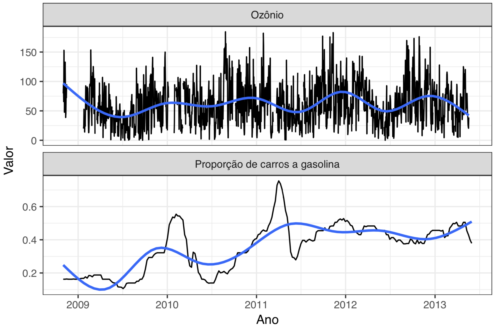
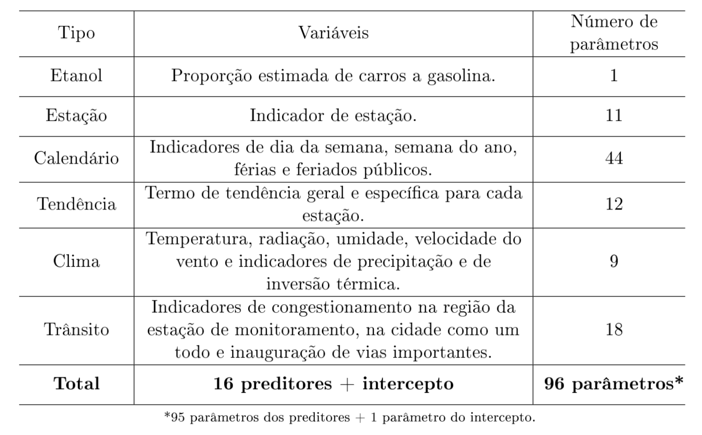
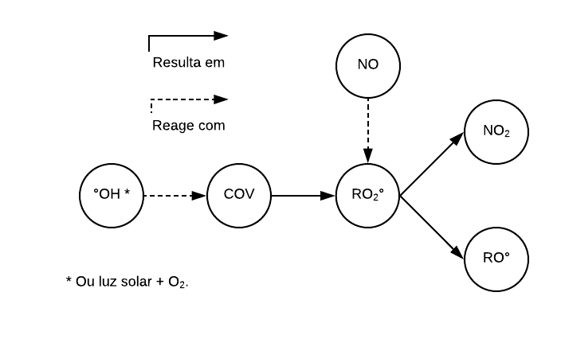
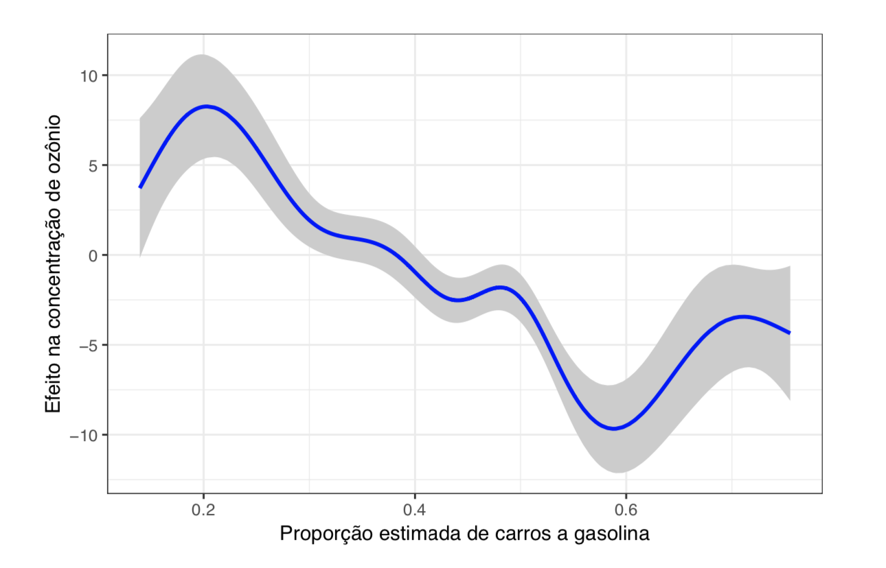
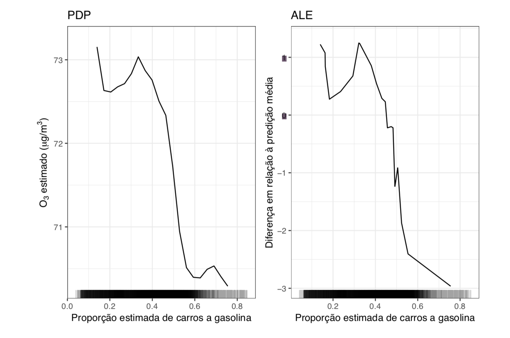
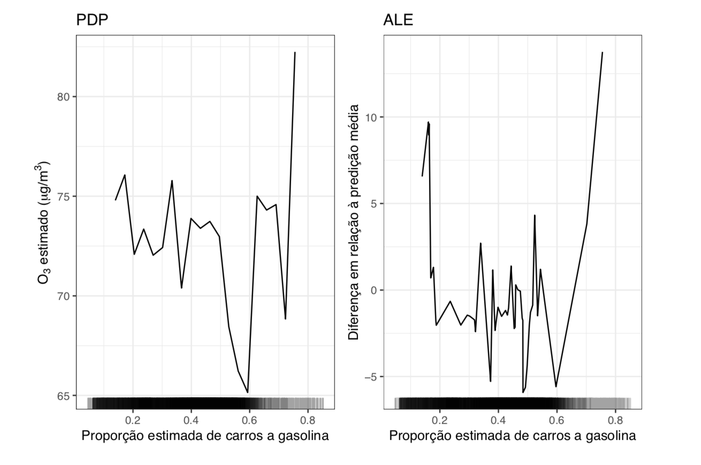
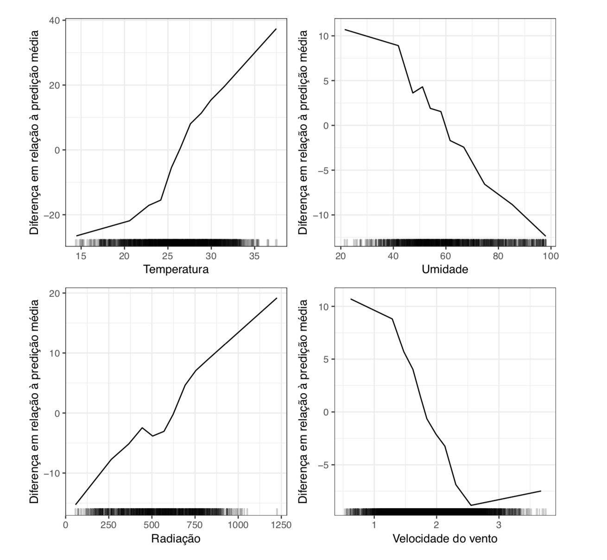
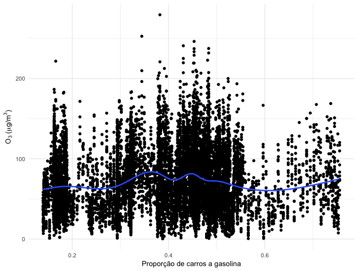
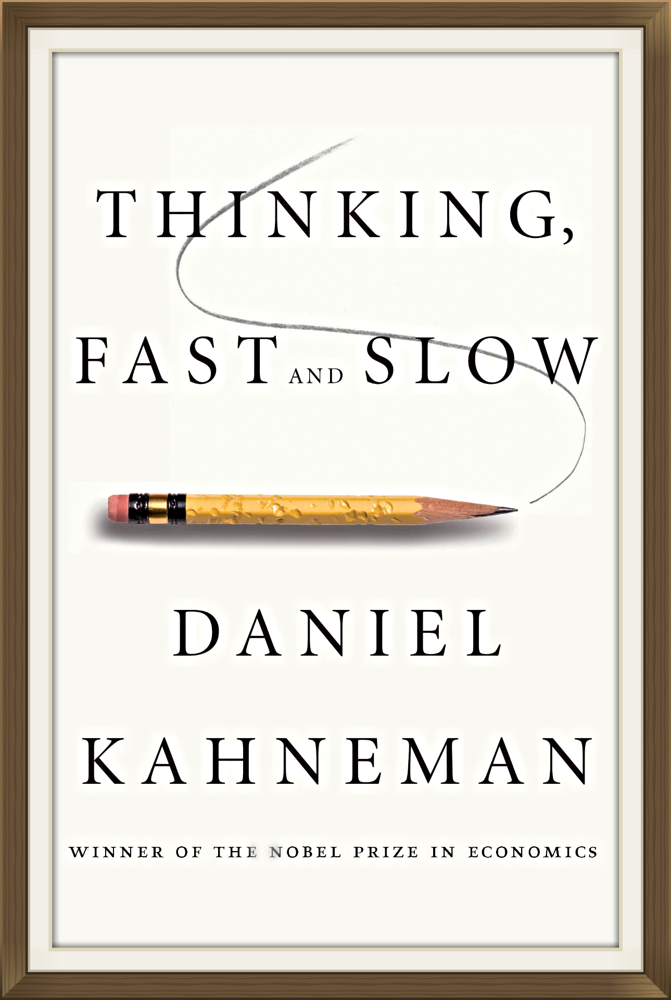

background-image: url('img/imagem-capa.png')

```{r setup, include=FALSE}
options(htmltools.dir.version = FALSE)
```

---

# Uso de etanol e concentração de ozônio

- Devido à dependência de combustíveis fósseis, o setor de transporte é o mais resiliente aos esforços de redução de emissões.

- O bioetanol é considerado uma boa alternativa ao uso de gasolina:
    - fonte quase renovável;
    - a queima gera menos MP, NO<sub>x</sub>, CO e CO<sub>2</sub>.
    
- Pode ser utilizado puro ou como aditivo da gasolina.

---

# Uso de etanol e concentração de ozônio

Embora o etanol seja considerado um combustível menos poluente, alguns estudos recentes sugerem associação entre o uso de etanol e o aumento da concentração de ozônio.

- *Reduction in local ozone levels in urban São Paulo due to a shift from ethanol to gasoline use* (Salvo e Geiger, 2014)

- *Reduced ultrafine particle levels in São Paulo's atmosphere during shifts from gasoline to ethanol use* (Salvo et al 2017)

---

# Estudo

- **Hipótese**: a média diária da concentração de ozônio (medida entre 12h e 16h) está associada com a proporção de carros a gasolina (entre os veículos bicombustíveis).

- **Local**: Região Metropolitana de São Paulo.

- **Período**: novembro de 2008 a maio de 2013.

- **Amostra**: 13203 dias.

---
class: middle, center



---
class: center, middle


---

### Estações de monitoramento

<center>

```{r, fig.align='center', echo=FALSE}
library(magrittr)
df <- readxl::read_excel("cetesb_station_geoposition.xlsx") %>% 
  dplyr::slice(1:6, 11, 14, 17, 18, 19, 20)

df %>%
  leaflet::leaflet() %>%
  leaflet::addTiles() %>%
  leaflet::addCircleMarkers(lng = ~long, lat = ~lat, popup = ~stationname)
```

</center>

---
class: center, middle

### A concentração média do ozônio troposférico caiu cerca de <br> 8.3 $\mu$g/m³ conforme a proporção de carros a gasolina subiu de <br> 30 para 80%.

---
class: center, middle




---
class: center, middle

```{r, echo=FALSE}
tibble::tibble(
  share = seq(0.2, 0.9, 0.01),
  o3 = -16.65661*share
) %>% 
  ggplot2::ggplot(ggplot2::aes(x = share, y = o3)) +
  ggplot2::geom_line() +
  ggplot2::geom_vline(xintercept = 0.3, linetype = 2) +
  ggplot2::geom_vline(xintercept = 0.8, linetype = 2) +
  ggplot2::labs(
    x = "Proporção de carros a gasolina",
    y = "Variação na concentração de ozônio"
  ) +
  ggplot2::theme_minimal()
```

---
class: middle, center

## Modelo aditivo generalizado

<video width="400" controls Autoplay=autoplay>
  <source src="img/loes-gif.mov" type="video/mp4">
</video>

---
class: middle, center

### Modelo aditivo generalizado



---
class: middle, center

### Floresta aleatória



---
class: middle, center

### XGBoost



---
class: middle, center

### XGBoost (clima)



---
# Desempenho dos modelos

<br>

```{r, echo=FALSE}
tibble::tibble(
  Modelo = c("XGBoost", "Floresta aleatória", "GAM", "Salvo et al."),
  RMSE = c(12.24,  14.11, 19.82, 19.75),
  R2 = c(88.56, 85.72, 70.50, 70.19),
  `Variáveis mais importantes` = c("Temperatura, umidade, radiação, tendência e vento", "Temperatura, umidade, radiação, tendência e vento", "Temperatura, vento, umidade, radiação e tendência", "Temperatura, velocidade do vento, radiação, umidade e var. ind. estação São Caetano do Sul")
) %>% 
  knitr::kable(format = "html", align = c("l", "c", "c", "c"))
```

---
class: middle, center



---
class: middle, center

# Conclusão

--

### Análise de dados é difícil

---
class: middle, center

# Github

Repositório da minha tese: <br>
[https://github.com/williamorim/tese](https://github.com/williamorim/tese)

Repositório com essa apresentação: <br> [https://github.com/williamorim/apresentacao-rbras-2019](https://github.com/williamorim/apresentacao-rbras-2019)

---
class: middle, center
## Referências

<a href = "http://www-bcf.usc.edu/~gareth/ISL/">
</img>
</a>

<br>

[Elements of Statistical Learning](https://web.stanford.edu/~hastie/ElemStatLearn/)

[Interpretable Machine Learning](https://christophm.github.io/interpretable-ml-book/agnostic.html)

---
class: middle, center



<br>

### O ser humano não nasce com (uma boa) intuição estatística

